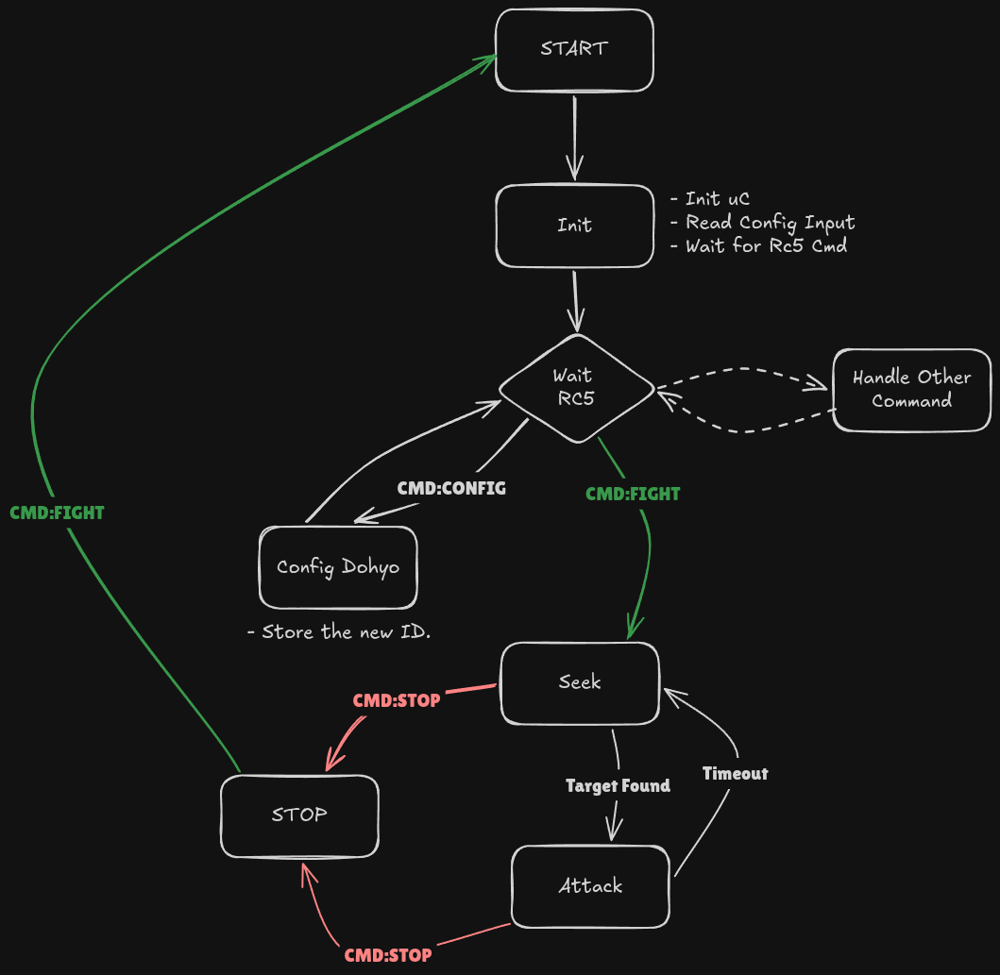

# 🤖 Robot 🤖 Minisumo FullMango

Mi robot de competición para la OSHWDEM 2026, el minisumo :tangerine: **FullMango** :tangerine:  (Perdón, no había emoji de un mango).

Hecho 100% en directos de Twitch y Youtube, desde las pruebas de concepto, la electrónica con PCB y la programación del microcontrolador de ST.
-   Twitch: [www.twitch.tv/labgluon](https://www.twitch.tv/labgluon)
-   Youtube: [www.youtube.com/labgoratoriogluon](www.youtube.com/labgoratoriogluon)

# :wrench: Componentes Principales :wrench:
- **PCB** : Diseño propio hecho en KiCAD, proyecto en carpeta `Schematics/MinisumoV2/`
- **Estructura:** Para añadir peso y consistencia esta basado en placas perforadas de acero cincado.
    - Diseño 3D alrededor de estas piezas hecho en OnShape (carpeta `3D').
- **Motores**: De maquina de tatuaje, coreless (Modelo M2610, Ref: [Aliexpress](https://es.aliexpress.com/item/4001010632280.html?spm=a2g0o.order_detail.order_detail_item.3.169258bfselo3b&gatewayAdapt=glo2esp))
- **Electrónica**:
    - *Procesador*: **STM32H523CCT6**
    - *Driver motores*: **MP6551**
    - *Sensor de línea*: **QRE1113** (Ref: [Aliexpress](https://s.click.aliexpress.com/e/_c4XDYlMh))
    - *Senor de enemigo*:  **GP2Y0E03** (Ref [Aliexpress](https://s.click.aliexpress.com/e/_c443dXyh))
    - *Alimentación* :
        - Batería 3S Tattu 550 mAh
        - Regulador switching: **TPS563201**
        - Regulador lineal: **AMS1117-3.3**

# :computer: Sobre el Software :computer:

El robot minisumo FullMango se basa en un control por máquina de estados. Siendo los 3 principales:
- **Wait RC5** (`start_state` en el código): Una vez que el Robot se ha inicializado correctamente espera a la señal del **mando RC5**
- **Seek** (`seek_state`): Es el patrón de búsqueda hasta encontrar al enemigo.
- **Attack** (`fight_state`): Cuando el robot ya ha encontrado al enemigo y va a por él.

## Control de motores

Para el control de motores se ha implementado una doble rampa de cara a intentar resolver el problema de los caballitos: los motores son muy potentes y si pasamos al 80% de golpe, el **robot se da la vuelta**.